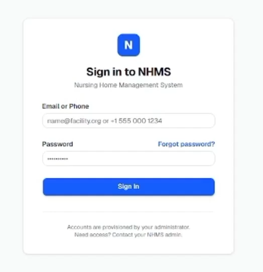

# Nursing Home Management System (NHMS) MockProject_062026


## 📖 Giới thiệu dự án
MockProject_062026 là hệ thống quản lý nhà dưỡng lão / chăm sóc người cao tuổi, hỗ trợ quản lý thông tin cư dân, kế hoạch chăm sóc, sự cố, báo cáo và các tác vụ vận hành nội bộ. Hệ thống được xây dựng theo mô hình web app, chia nền tảng thành frontend và backend riêng biệt, dễ triển khai và quản lý trong môi trường phát triển cũng như Docker.

## Video demo dự án


https://youtu.be/zI9nwtYnUxo

## 🧩 Cấu trúc công nghệ

### 1) Frontend
- Node.js: 24.x (được dùng trong Dockerfile Frontend: `node:24-alpine`)
- NPM: bản mới nhất tương thích với Node 24
- TypeScript: ~6.0.2
- Vite: 8.1.0
- React: 19.2.7
- React DOM: 19.2.7
- React Router: 7.18.1
- @tanstack/react-query: 5.101.1
- Tailwind CSS: 4.3.1
- shadcn/ui + Radix UI components
- Axios: 1.18.1
- Zod: 4.4.3
- Zustand: 5.0.14
- React Hook Form: 7.81.0
- date-fns: 4.4.0
- Lucide React: 1.23.0

### 2) Backend
- Java: 21
- Maven: 3.9.x trở lên
- Spring Boot: 4.1.0
- Spring Web, Spring Security, Spring Validation, Spring Data JPA
- SQL Server JDBC Driver: `com.microsoft.sqlserver:mssql-jdbc`
- Hibernate / JPA
- Lombok: 1.18.42
- MapStruct: 1.6.3
- H2 Database: runtime (dùng cho test / local nhanh)
- Docker base image: `eclipse-temurin:21-jre-alpine`

### 3) Cơ sở dữ liệu và môi trường chạy
- SQL Server 2019 / SQL Server container
- Docker Desktop hoặc Docker Engine
- Docker Compose v2
- Git

## 💻 Yêu cầu hệ thống

### Phần Frontend
- Hệ điều hành: Windows 10/11, macOS, Ubuntu/Linux
- Node.js 24.x
- NPM 10.x trở lên
- Trình duyệt hiện đại: Chrome, Edge, Firefox
- RAM tối thiểu: 4 GB
- Disk: tối thiểu 5 GB trống

### Phần Backend
- JDK 21
- Maven 3.9.x
- SQL Server 2019 hoặc container SQL Server tương thích
- RAM tối thiểu: 4 GB
- Disk: tối thiểu 8 GB trống
- Docker (nếu chạy theo cấu hình compose)

## 🛠 Hướng dẫn cài đặt và chạy bằng Docker Compose
Dự án đã có sẵn file `docker-compose.yml` ở thư mục gốc. Bạn có thể chạy toàn bộ hệ thống theo 1 lệnh và không cần cài đặt riêng từng phần nếu đã có Docker trong máy.

### Bước 1: Clone repository
```bash
git clone <URL_REPOSITORY>
cd MockProject_062026_Nhom1
```

### Bước 2: Kiểm tra Docker đang chạy
```bash
docker --version
docker compose version
```
Nếu Docker Desktop trên Windows/macOS chưa chạy, hãy bật lên trước.

### Bước 3: Build và chạy toàn bộ hệ thống
```bash
docker compose up --build -d
```
Lệnh trên sẽ tự động:
- build backend từ `backend/Dockerfile`
- build frontend từ `frontend/Dockerfile`
- khởi động database SQL Server
- khởi động service backend và frontend

### Bước 4: Kiểm tra trạng thái container
```bash
docker compose ps
```
Bạn sẽ thấy các container như:
- `eldercare-db`
- `eldercare-backend`
- `eldercare-frontend`

### Bước 5: Truy cập ứng dụng
- Frontend: http://localhost:5173
- Backend API: http://localhost:8080
- Database SQL Server: localhost:1433

### Bước 6: Xem log nếu cần
```bash
docker compose logs -f backend
docker compose logs -f frontend
docker compose logs -f db
```

### Bước 7: Dừng hệ thống
```bash
docker compose down
```
Nếu muốn xóa cả dữ liệu database:
```bash
docker compose down -v
```

## 🏃 Hướng dẫn chạy local mà không dùng Docker
Nếu muốn chạy riêng từng phần cho mục đích phát triển:

### Frontend
```bash
cd frontend
npm install
npm run dev
```
Mặc định ứng dụng chạy ở:
- http://localhost:5173

### Backend
Yêu cầu đã cài JDK 21 và Maven.
```bash
cd backend
./mvnw clean install
./mvnw spring-boot:run
```
Backend sẽ chạy tại:
- http://localhost:8080

## 🔐 Thông tin môi trường mặc định
Trong file `docker-compose.yml`, dự án đang dùng các thông số sau:
- Database name: `elder_care_21_jul`
- Username: `sa`
- Password: `MatKhauCuaBan123!`
- Backend port: `8080`
- Frontend port: `5173`

> Lưu ý: các giá trị này dùng cho môi trường local/demo. Nên thay bằng cấu hình bảo mật hơn khi triển khai thực tế.

## 📌 Ghi chú
- Frontend đang có cấu hình Nginx để proxy request `/api` sang backend qua cổng `8080`.
- Backend dùng Spring Boot 4.1.0 và Java 21 nên máy cần đầy đủ môi trường tương thích.
- Nếu bạn đổi tên project hoặc cấu hình CORS, hãy cập nhật tương ứng trong `backend/src/main/resources/application-dev.yml` và cấu hình frontend.

## 🚀 Kết luận
Dự án này có thể được triển khai nhanh chóng bằng Docker Compose, phù hợp cho môi trường phát triển và demo. Nếu bạn cần, tôi có thể tiếp tục bổ sung thêm phần mô tả chức năng chi tiết theo từng màn hình, API danh sách endpoint, hoặc tạo file `.env.example` để quản lý cấu hình an toàn hơn.